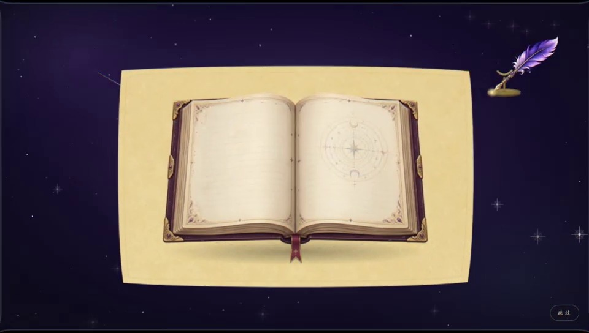
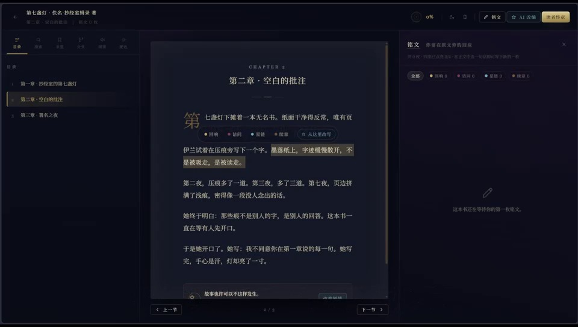
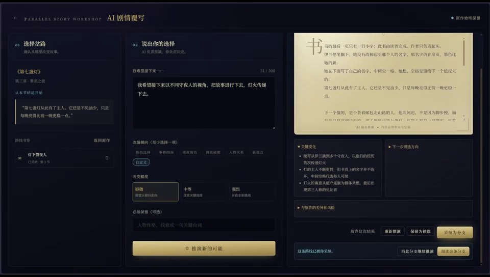
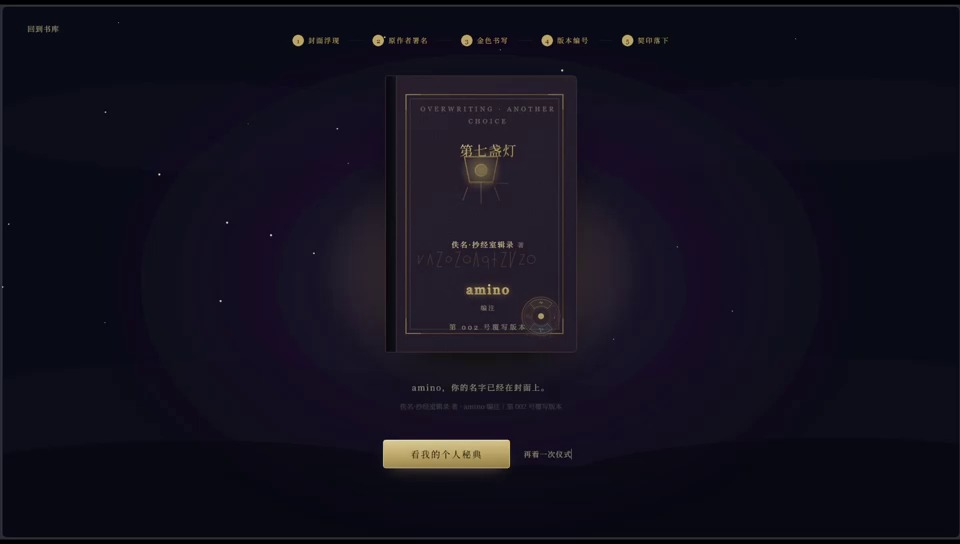

# 覆写：故事新编

> **OVERWRITING: ANOTHER CHOICE**<br>
> 一款融合沉浸式阅读、互动批注与 AI 剧情推演的故事新编应用。

“覆写”希望让读者不再只是故事的旁观者。读者可以在原文旁留下自己的回应，从任意情节节点推演另一种可能，最终生成带有个人阅读痕迹与署名的专属版本。

## 产品展示

<table>
  <tr>
    <td width="50%" align="center">
      
      <br><strong>沉浸式开场</strong><br>羽毛笔书写、魔法书展开，建立完整的阅读仪式感。
    </td>
    <td width="50%" align="center">
      
      <br><strong>阅读与铭文</strong><br>在原文中选择文字，留下与内容位置绑定的个性化批注。
    </td>
  </tr>
  <tr>
    <td width="50%" align="center">
      
      <br><strong>AI 剧情覆写</strong><br>设定改写意图与约束，让故事从指定节点生长出新的分支。
    </td>
    <td width="50%" align="center">
      
      <br><strong>契名与个人秘典</strong><br>汇总阅读、批注与改写成果，完成属于读者自己的版本。
    </td>
  </tr>
</table>

以上图片截取自项目宣传视频。

## 核心理念

传统阅读通常在故事结尾停止，而“覆写”把阅读理解、情感回应和故事创作连接成一条连续体验：

1. **读原作**：导入自己的 TXT 文本，或阅读内置示例藏书。
2. **留铭文**：针对具体原文留下“回响、诘问、星链、续章”四类回应。
3. **开分支**：从选中文字、章节结尾、续章铭文或已有分支继续推演。
4. **写终章**：以读者身份完成一篇属于自己的阅读回应。
5. **完成契名**：将原作、铭文、分支和读者终章汇聚为个人秘典。

## 核心功能

- **沉浸式开场动画**：羽毛笔绘制、书页显现与魔法书放大入场。
- **秘典书库**：内置示例书籍，支持导入 UTF-8 编码的 TXT 文本。
- **智能拆章与分段**：识别“第 X 章”等标题，并兼容空行、段首缩进和排版软换行。
- **沉浸式阅读器**：支持章节翻页、目录、书签、搜索、字号与行距调节、夜间模式和语音朗读。
- **四类铭文**：
  - 回响：记录共鸣与感受；
  - 诘问：提出疑问或不同意见；
  - 星链：联结其他作品、经历或人物；
  - 续章：从原文继续创作。
- **AI 剧情覆写**：输入改写目标、倾向、强度和必须保留的内容，由 AI 生成新的故事走向。
- **分支管理**：保存、切换、继续生长或删除剧情分支，原文始终保持不变。
- **读者终章与契名仪式**：汇总个人阅读成果，生成署有原作者与读者名字的个人版本。
- **本地优先存储**：前端以浏览器 localStorage 为主存储；后端提供按用户隔离的持久化副本。
- **演示模式**：无需 AI Key 即可体验完整的预设改写流程。

## 团队成员

| 成员 | 负责内容 |
|---|---|
| **张梓涵** | 项目总规划、部分前端开发 |
| **李文泽** | 后端开发 |
| **房子晴** | 前端开发 |
| **蔡欣宇** | 宣传视频、项目 PPT |

## 技术架构

| 层级 | 主要技术 | 职责 |
|---|---|---|
| 前端 | Vite、React、原生 JavaScript、CSS | 开场动画、书库、阅读器、铭文、覆写工作台与契名流程 |
| 后端 | FastAPI、SQLModel | 文件导入、书籍/分支/铭文接口、AI 覆写请求 |
| AI 流水线 | LangGraph、OpenAI 兼容接口、DeepSeek | 剧情分析、改写、审查与分支生成 |
| 数据库 | MySQL 8.0；未配置时降级 SQLite | 保存书籍、章节、段落、铭文和剧情分支 |
| 本地状态 | localStorage | 保存当前浏览器中的阅读进度和交互状态 |

## 项目结构

```text
backend/
  main.py                 # FastAPI 路由与接口
  db.py                   # 数据模型、数据库连接与建表
  library.py              # 书籍、分支和铭文持久化逻辑

literary_agent/
  chapters.py             # TXT 拆章与自然段识别
  overwrite.py            # AI 剧情覆写流水线
  config.py               # AI、数据库与路径配置

frontend/
  public/legacy/js/       # 书库、阅读器、覆写、契名等交互
  public/legacy/css/      # 页面样式
  src/                    # React 开场动画

docs/images/              # README 产品展示图片
inputs/                   # 导入的原文
tests/                    # 自动化测试
```

## 本地运行

### 环境要求

- Python 3.12
- [uv](https://docs.astral.sh/uv/)
- Node.js
- MySQL 8.0（可选；未配置时使用 SQLite）

### 1. 克隆项目

```bash
git clone https://github.com/PlutoNebula/Overwriting--AnotherChoice.git
cd Overwriting--AnotherChoice
```

### 2. 启动后端

```bash
# Windows PowerShell
Copy-Item .env.example .env

uv sync
uv run uvicorn backend.main:app --host 127.0.0.1 --port 8000
```

后端接口文档：<http://127.0.0.1:8000/docs>

如果没有配置 MySQL，应用会自动在项目目录中使用 SQLite，书籍、分支和铭文接口仍可正常运行。

### 3. 启动前端

```bash
cd frontend
npm install
npm run dev
```

浏览器打开：<http://localhost:5173>

演示模式：

```text
http://localhost:5173/?demo=1&autoplay=1
```

## 环境配置

复制 `.env.example` 为 `.env` 后按需填写：

| 配置项 | 默认值 | 说明 |
|---|---|---|
| `DEEPSEEK_API_KEY` | 空 | DeepSeek 或其他 OpenAI 兼容服务的 API Key |
| `DEEPSEEK_BASE_URL` | `https://api.deepseek.com` | AI 服务地址 |
| `DEEPSEEK_MODEL` | `deepseek-chat` | 模型名称 |
| `MYSQL_HOST` | `127.0.0.1` | MySQL 地址 |
| `MYSQL_PORT` | `3306` | MySQL 端口 |
| `MYSQL_USER` | `root` | MySQL 用户名 |
| `MYSQL_PASSWORD` | 空 | MySQL 密码 |
| `MYSQL_DATABASE` | `overwriting` | 数据库名称 |

> 请勿把包含真实 API Key 或数据库密码的 `.env` 提交到 GitHub。

## 主要接口

| 方法 | 地址 | 说明 |
|---|---|---|
| `GET` | `/health` | 后端健康检查 |
| `POST` | `/api/import` | 导入 TXT/Markdown 并拆分章节 |
| `PUT` | `/api/books/{book_id}` | 保存书籍及章节 |
| `GET` | `/api/books/{book_id}` | 获取书籍 |
| `PUT` | `/api/books/{book_id}/branches/{branch_id}` | 保存剧情分支 |
| `PUT` | `/api/books/{book_id}/inscriptions/{ins_id}` | 保存铭文 |
| `POST` | `/api/v1/rewrite/generate` | 生成 AI 剧情覆写结果 |
| `POST` | `/api/v1/ai/test` | 测试 AI 模型连接 |

## 数据说明

- 浏览器 localStorage 是前端交互状态的主要存储。
- 后端按照 `user_id` 隔离书籍数据。
- MySQL 未就绪时自动使用 SQLite。
- 删除父分支时，子分支会自动提升到上一级，不会被级联误删。
- 删除整本书时，对应章节、段落、分支和铭文会一并清理。

---

如果你也曾在读完一个故事后想过“要是当时做了另一种选择呢”，欢迎打开《覆写》，从那个瞬间继续写下去。
